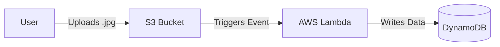

# 🚀 Terraform AWS S3 → Lambda → DynamoDB Automation – Week 3 Project
**Terraform Serverless Event-Driven Architecture (IaC)**

This repository demonstrates how to build an event-driven serverless architecture on AWS using **Terraform**.  
The goal of this project is to automate image processing using the following flow:

📤 **S3 Upload (.jpg file)** → ⚡ **Triggers Lambda Function** → 🗂️ **Stores Metadata into DynamoDB**

All AWS resources — S3 bucket, Lambda function, IAM permissions, and DynamoDB table — are provisioned using Infrastructure as Code (IaC) with Terraform.

---

## 🏗️ Project Architecture

This project creates the following components:

### **1️⃣ S3 Bucket (module: `s3`)**
- Stores uploaded images.
- Triggers a Lambda function when a `.jpg` file is uploaded.
- Bucket name is built using `bucket_prefix` + environment.

### **2️⃣ Lambda Function (module: `lambda`)**
- Processes images uploaded to S3.
- Writes metadata into DynamoDB.
- Has correct IAM permissions (S3 read + DynamoDB write).
- S3 is allowed to invoke Lambda through `aws_lambda_permission`.

### **3️⃣ DynamoDB Table (module: `dynamodb`)**
- Stores image metadata.
- Table name: `metadata-<env>`
- Partition key: `ImageID`.

### **4️⃣ S3 → Lambda Event Notification**
Configured using:

```hcl
resource "aws_s3_bucket_notification" "bucket_notification" {
  bucket = module.s3.bucket_id

  lambda_function {
    lambda_function_arn = module.lambda.function_arn
    events              = ["s3:ObjectCreated:*"]
    filter_suffix       = ".jpg"
  }

  depends_on = [module.lambda]
}
```
---

### 🚀 Deployment Steps

1️⃣ Initialize Terraform
```bash
terraform init
```
2️⃣ Validate and Plan
```bash
terraform validate
terraform plan
```
3️⃣ Apply Infrastructurre
```bash
terraform apply
```
4️⃣ Destroy (when needed)
```bash
terraform destroy
```
⚠️ Before destroying, migrate your state back to local if you want to delete the S3 backend bucket:
```bash
terraform init -migrate-state -backend-config="path=terraform.tfstate"
```
---
### 🧪 How It Works (End-to-End Flow)

1.  **Upload:** Upload any `.jpg` image to the S3 bucket created by Terraform.
2.  **Trigger:** The S3 event automatically triggers the Lambda function.
3.  **Process:** Lambda processes the image and generates metadata.
4.  **Store:** Metadata is stored in the DynamoDB table `metadata-dev`.
5.  **Verify:** You can query DynamoDB to view stored metadata.


---
### 📤 Outputs

After deployment, you can verify the following Terraform outputs:

- **S3 Bucket Name** – the bucket where you will upload `.jpg` files.
- **DynamoDB Table Name** – the table where metadata is stored.
You can view all outputs by running:

```bash
terraform output
```

---
### ❗ Important Terraform Notes
DO NOT commit:
```bash
.terraform/
terraform.tfstate
terraform-provider-*
```
Always use .gitignore before running:
```bash
terraform init
```

---
💬 Want to Improve This Project?
Feel free to fork the repo and raise PRs 👇
https://github.com/lucifer045/Terraform_AWS

---

### 👨‍💻 Author
**Prince Raghav** — Freelance DevOps & SRE Engineer  
🔗 GitHub: https://github.com/lucifer045  
🔗 LinkedIn: https://www.linkedin.com/in/prince-raghav
